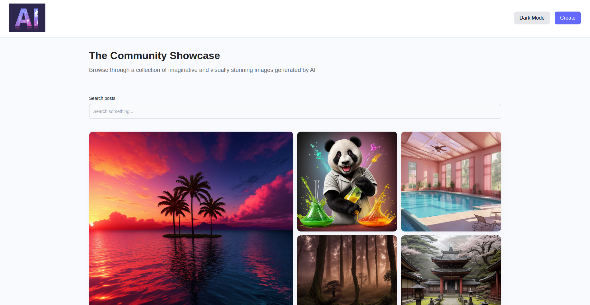
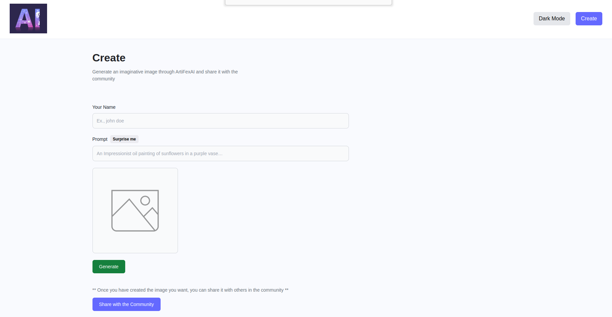
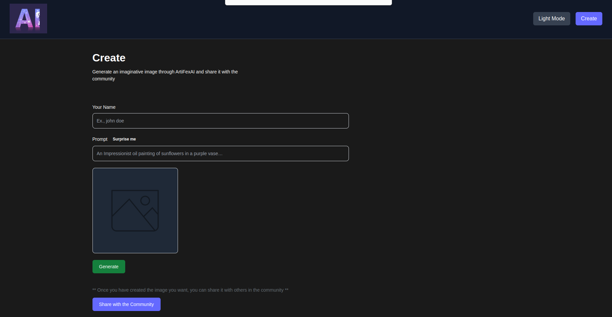
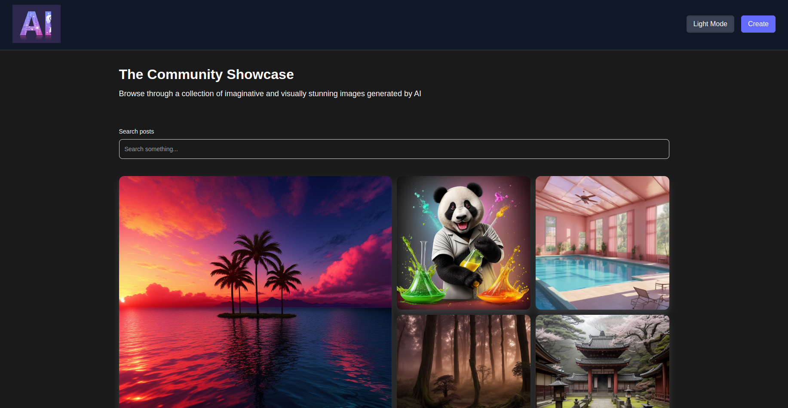
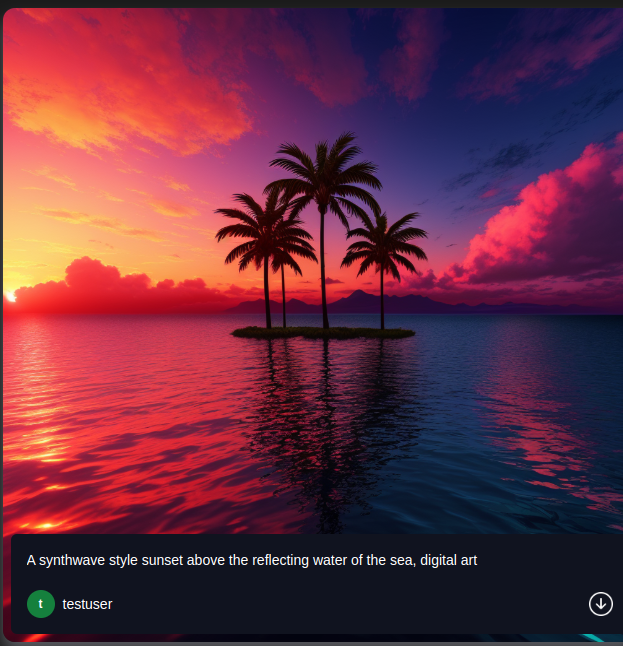

# ArTiFexAI
A full-stack MERN application that transforms your imagination into reality by generating AI-powered images from text prompts, bringing your creativity to life.

## 🚀 Live Application
https://artifexai.onrender.com

<div style="display: flex; align-items: center; justify-content: space-evenly; flex-wrap: wrap; gap: 1rem">
    
    
    
    
    
</div>

## 🎨 Key Features
-- **AI Image Generation:** Create clean, high-quality images simply by providing a text prompt.

-- **Light & Dark Themes:** Enjoy a personalized experience with support for both light mode and dark mode.

-- **NSFW Detection:** Uses Perspective API to detect and filter out inappropriate prompts based on profanity and sexually explicit content.

-- **Community Sharing:** Share your generated images with the community and explore images created by others.

-- **Download & Save:** Easily download any image from the community gallery to your local device.

-- **User-Centric Interface:** A clean, modern, and accessible UI designed for effortless navigation and a smooth user experience.

 -- **Surprise Me:** Not sure what to write in the prompt? This feature will generate a random prompt for you.

## 🛠️ Tech Stack
- **Frontend:** React.js, HTML5, CSS3, Tailwind CSS
- **Backend:** Node.js, Express.js,
- **Database:** MongoDB Atlas
- **APIs:** RESTful API design, Cloudinary,RapidAPI and Perspective API
- **Hosting:** Render


## 📂 Project Structure
The project is divided into two main parts: client(frontend) and server(backend).

## ⚙️ Setup and Installation
Clone the repository 
```bash
git clone https://github.com/divyansh1705/ArtiFexAI.git
```
### Client Setup
1. Install dependencies:
```bash
cd frontend
npm install
```

3. Start the development server:
```bash
npm run dev
```

### Server Setup
1. Install dependencies:
```bash
cd backend
npm install
```

2. Set up environment variables as shown in .env.example
```

3. Start the backend server:
```bash
npm run dev
```

## 📝 Contribution Guidelines
To contribute:
1. Fork the repository.
2. Create a new branch for your feature/bug fix.
3. Commit your changes with meaningful commit messages.
4. Push to your fork and submit a pull request.

## 📬 Contact
For any issues or suggestions, contact me at divyanshd@iitbhilai.ac.in